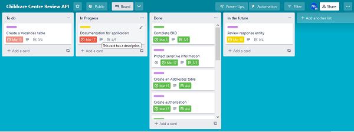

# CHILDCARE CENTRE API DOCUMENTATION

## Developed by Nicole Hulett

[GitHub - Childcare Centre API](https://github.com/Coder-Nicki/childcare_centre_api)

[Trello - Project Management](https://trello.com/b/tMMIqMil/childcare-centre-review-api)

### Instructions for installation:

1. Click on GitHub link [here](https://github.com/Coder-Nicki/childcare_centre_api) or above

2. Clone the project to your local computer

3. Create a virtual environment 
- ```python3 -m venv .venv```
- ```source .venv/bin/activate```

4. Install the requirements text 
```pip install requirements.txt```

5. Create the database (in psql)
    1. ```sudo -u postgres psql```
    2. ```CREATE DATABASE childcare_api_db;```
    3. ```\c childcare_api_db;```
    4. ```CREATE USER db_dev WITH PASSWORD 'tnsknt';```
    5. ```GRANT ALL PRIVILEGES ON childcare_api_db to deb_dev;```

6. Type ```Flask run``` in your command line

7. Open up Insomnia or Postman to test out routes


### R1 	Identification of the problem you are trying to solve by building this particular app.

Childcare is an industry that is currently seeing rapid growth in Australia. Most parents are now required to seek care for their child or children in the first 5 years of their lives as they return to work. For many parents this is a daunting prospect. All parents want the very best for their children. They want a childcare that will keep their child safe and provide a stimulating environment where they can grow and develop. However, finding the right childcare is often difficult. Most childcares these days do have a website or are listed on a directory of childcares with their current NQS (National Quality Standard) rating. But this doesn’t give parents the positive or negative feel for a centre. Parents most trust word-of-mouth from other parents that have or have had their child or children at the centre and experienced the daily operations of care. This application aims to replicate this idea by providing users with the ability to create a childcare centre listing, if one is not already available within the app, and then to provide a review of the childcare centre and give it a parent rating out of 10. Any user is then able to search the different childcare centres using multiple filters and read the reviews, good or bad, about each centre. This is all able to be done before calling up a centre and going for a tour. It will certainly reduce the number of centres that parents may have to visit to find the perfect fit for their child. This is so important in today’s busy world. 

### R2 	Why is it a problem that needs solving?

This problem needs solving as there is no current, simple way to search and compare childcare centres that provide parent reviews. Any current web sites or applications only provide the actual details and description of the centre. This is no longer enough for parents these days. Parents want to know what others think, parents want to be able to make an informed decision. Parents also do not want to waste their precious time going on countless tours of numerous childcare centres that would obviously not be a good fit for their child. 
This application would make the search for and decision about a childcare centre much simpler. It is important that this problem is solved soon, as childcare is an ever-growing industry. It is currently growing at a super rapid rate and appears to still not be keeping up with demand as more parents then ever, due to the rise in the cost of living and other reasons, require childcare for their young children. 

### R3 	Why have you chosen this database system. What are the drawbacks compared to others?

I have chosen to use a PostgreSQL database system as it is an object relational database management system that suits my project. My project is made up of related entities and a PostgreSQL system allows my data to be structured and defined in an appropriate, tabular way. PostgreSQL stores information in tables. Each table is required to have at least one column that has a specific data type and the rows of the table make up the records. A row is a single value entry that adheres to the predefined schema. A schema is like a blueprint or set of rules for what can or cannot enter the table. (Lemonaki, 2022). This is appropriate for my childcare_centre API project that has a number of different entities that would be translated into tables to store the incoming or outgoing information. PostgreSQL also allows for more than one table and for these tables to be related to one another. PostgreSQL uses the main data types as required by my application such as; string, boolean, integer and date/time. This DBMS also provides the needed constraints for my projects like, UNIQUE and NOT NULL. Primary Keys and Foreign Keys can also be used which are essential to develop the relationships between the different entities in my project and ensure data integrity and security. In addition, PostgreSQL supports the use of the Python programming language. PostgreSQL databases can be queried with simple or complex commands to perform any of the CRUD (Create, Read, Update, Delete) operations needed for my project. Another benefit of PostgreSQL is for security purposes. These databases don't require as much engineering effort to make them well protected, as a lot of the heavy lifting is done already, behind the scenes due to the integrated structure of the system. 

#### Disadvantages
Some disadvantages of PostgreSQL are; 
- It is slower in it’s processing capabilities compared to MySQL or NoSQL database managements systems. 
- They are not as capable to scale for really large volumes of a users as their design is not as distributed as other systems. 
- Not all open-source applications will support a PostgreSQL database. (Sharda, 2021).

Comparison to other DBMS:
Other Database management systems are MySQL, Oracle, MongoDB, Cassandra and more. Databases are divided into two groups; relational databases and non-relational databases also referred to as SQL and NoSQL databases. PostgreSQL is a relational database system. Another similar relational database is MySQL. MySQL has a very plain structure and style that is very easy to learn and use and it has cloud compatibility. The drawbacks of MySQL is that it is owned by Oracle and is not completely open source like PostgreSQL. This means that there is not as much open source support and the developer will have to pay the corperate owners for support. MySQL is also not easily scalable, it will be a very complex effort to do so. Also MySQL doesn't completely follow SQL specific standards. MySQL is best for small web based solutions with a small volume of data. In comparison, PostgreSQL is completely open source and has a strong community where you can always expect free and prompt assistance. PostgreSQL also has better vertical scalabilty than MySQL which allows the database to grow if needed. (altexsoft, 2021)

Overall, PostgreSQL is a great fit as a DBMS for this API project to store and query the data in an organised and defined way and has the potential to be able to scale larger if needed in the future. For a novice developer, there is also free community support available which is an added extra for this database design.

### R4 	Identify and discuss the key functionalities and benefits of an ORM

An ORM (Object Relational Mapping) is a way to connect an Object Orientated Program (OOP) with a relational database. An ORM helps to simplify the process of interacting with a database for the different CRUD operations like creating, reading, updating and deleting. Normally these interactions are done through SQL (structured query language) commands. (Abba, 2022)

An ORM uses much simpler methods to query the database. In this API project the Python programming language is used, therefore SQLAlchemy is a great choice for the ORM system. SQLAlchemy has great features and uses function-based query construction that allows SQL queries to be built similar to Python functions and expressions. SQLAlchemy can utilise the full range of functions to query a PostgreSQL database and can also use raw SQL statements if needed. In addition, SQLAlchemy uses composite behaviour and primary and foreign keys are represented in their own unique columns with the compatibility to ‘ON DELETE CASCADE and other tools and expressions for relationships within a database. (Features and Philosophy, n.d.)

#### Key functionality of an ORM:
-	Allows queries to be made to the database to manipulate the data using your program of choice, instead of plain SQL.
-	ORMs generate objects which map to tables in the database.
-	ORMs translate data/code and create a map that defines the database structure. The ORM can then explain how objects are related in different tables.
-	The ORM then uses its mapping information to convert data between tables to generate the SQL code that matches certain queries to cover the CRUD (create, read, update and delete) functionality.

#### Benefits

The benefits of using an ORM are; it handles the logic required to interact with databases, it improves security and eliminates the possibility of SQL injection attacks, you write less code using ORM tools compared to just using plain SQL queries, it speeds up development time and queries via the ORM can be written irrespective of whatever database is being used in the back end. ORMs are also available for any object orientated language, so it is not specific for just one language. 

#### Drawbacks

The disadvantages of using ORM tools are; it can be time consuming to learn, the processing time can be slower compared to SQL commands and they don’t perform as well when using super complex queries. Also a lot of magic happens behind scenes when using an ORM, so that can create confusion or difficulty in understanding the process. 

### R5 	Endpoints for the API

#### User Endpoints:

#### Public endpoints
- ``` @user.get('/')``` Gets a list of all users
- ```@user.get('/<int:id>')``` Finds a user by id number
- ```@user.get('/admins')``` Gets a list of all admin users
- ```@user.route("/register", methods=["POST"])``` creates a new user and logs them in

#### Protected endpoints
- ```@user.route("/login", methods=["POST"])``` logins in an already registered user
- ```@user.delete('/<int:id>')``` deletes a user

#### Childcare Centre Endpoints:

#### Public endpoints
- ```@childcare_centre.get('/')``` gets a list of all childcare centres
- ```@childcare_centre.get('/<int:id>')``` finds a childcare centre by id number
- ```@childcare_centre.get('/fee_range')``` lists the childcare centres from cheapest to most expensive
- ```@childcare_centre.get('/cheapest')``` finds the cheapest childcare centre
- ```@childcare_centre.get('/small_centres')``` gets a list of childcare centres that have a maximum capacity of under 50 kids
- ```@childcare_centre.get('/maximum_capacity/<int:maximum_capacity>')``` gets a list of childcare centres that have under a specified number of kids

#### Protected endpoints
- ```@childcare_centre.post("/")``` post a new childcare centre
- ```@childcare_centre.route("/<int:id>/", methods=["PUT"])``` update the details of a childcare centre
- ```@childcare_centre.delete('/<int:id>')``` finds a given childcare centre and deletes it.

### Review Routes:

#### Public endpoints
- ```@review.get('/')``` gets a list of all reviews
- ```@review.get('/<int:id>')``` finds a review by id
- ```@review.get('/<int:childcare_centre_id>')``` finds a re view by childcare centre id
- ```@review.get('/rating')``` gets a list of any childcare centres with a parent rating over 8

#### Protected endpoints
- ```@review.post("/")``` posts a new review
- ```@review.delete('/<int:id>')``` finds a review by id and deletes it

### Address Routes

#### Public endpoints
- ```@address.get('/childcare_centre/<int:childcare_centre_id>')``` finds an address by childcare centre id
- ```@address.get('/<string:suburb>')``` gets a list of childcare centres at a certain suburb
- ```@address.get('/postcode/<string:postcode>')``` gets a list of addresses from a specified postcode

#### Protected endpoint
- ```@address.post("/")``` creates a new address

### R6 	An ERD for your app


### R7 	Third party services that the app will use

Flask – Flask is a lightweight WSGI web application framework that allows developers to easily develop web applications. It is simple to use, but also extensible, which means the developer can easily extend its functionality and scale it up for more complex applications. The Flask web framework is written in Python and includes a collection of libraries and modules that allow an application to be built without having to worry about the low-level details of a web application and other protocols. 

Flask-SQLAlchemy – Flask-SQLAlchemy is an extension for Flask that adds support for SQLAlchemy in the application. Flask-SQLAlchemy is an ORM (Object Relational Mapper). It provides developers with a toolkit for the full functionality and flexibility of SQL. It helps to facilitate the communication between the application and the database. It translates Python classes to tables and converts function calls to SQL statements. 

Flask-Marshmallow – Flask-Marshmallow adds a thin integration layer between Flask and Marshmallow that provides additional features and can also optionally integrate with Flask-SQLAlchemy. Marshmallow is a Python library that converts complex data types to native Python data types and vice versa. It provides object serialization/deserialization.

Marshmallow-SQLAlchemy – Marshmallow-SQLAlchemy is a package that allows SQLAlchemy to integrate with the Marshmallow serialization/ library and assists in creating the schema more efficient. 

Flask-JWT-Extended – Flask-JWT-Extended adds support for using JSON Web Tokens. JSON web tokens are used in a Flask application for protecting routes and providing authentication to users. Flask-JWT-Extended has a lot of optional, but helpful features that you can use add to the project to make working with these tokens easier. 

Datetime - Date was imported from the datetime package for this API to use in the Review class and model to allow an automatic date to be posted for the current day when the review is made.

### R8 	Describe your projects models in terms of the relationships they have with each other.

The five models for this project are User, Childcare Centre, Address, Vacancy and Review.

The relationship between User and Childcare Centre is a one-to-many relationship. One User can post many Childcare Centres, but a Childcare centre can only be posted by one User. In addition, if a User is deleted, this should not delete a childcare centre listing, therefore a constraint of ```nullable=True``` is applied to the relationship. When a user is deleted, if the user had posted any childcare centres, these listings will be kept, but their user_id will become ```NULL```. However, if a Childcare centre is deleted, it does no affect the user details, as the foreign key is provided only in the many side of the relationship which is in the Childcare centre table. A ```UNIQUE```constraint for the username attribute of the Users table is also stated, so that a username must be unique and can not be duplicated.

User and Review is also a one-to-many relationship. One User can post many Reviews, but one Review belongs to one User. If a User is deleted, then the reviews associated with them will also be deleted by a constraint on the relationship of ```cascade=["all, delete]```. The foreign key for the user table is listed in the Reviews table and has a further constraint of ```Nullable=False```, meaning that a user_id must be provided at all times. An individual review is able to be deleted by a logged in admin user. This deletion only occurs to the review and has no affect on the user listing. 

Childcare Centre and Address have a one-to-one relationship. One Childcare Centre can have one Address and an Address can only belong to one Childcare Centre. To make this a one-to-one relationship, ```uselist=False``` is added to the relationship statement as this is a bidirectional relationship which will have a scalar result, it should not be able to show a list. The childcare centre id is shown as a foreign key in the Addresses table and is set to ```Nullable=False``` so that it must be required, as an address must be joined to a specific childcare centre. If a childcare centre is deleted, the address is also deleted. This is attained by adding ```cascade=["all, delete"]``` to the relationship statement. There is also no option to delete an address, so an address will remain while their is a joined childcare centre.

Childcare Centre and Review has a one-to-many relationship. One Childcare Centre can have many Reviews, but a Review only belongs to one Childcare Centre. The primary key of the childcare centre is placed as a foreign key in the Reviews table. The relationship statement indicates ```cascade=["all, delete"]```, so if a childcare centre is deleted, all the reviews associated will also be deleted. However, if a specific review is deleted this will not affect the childcare centre listing or the other reviews. 

Childcare Centre and Vacancies have a one-to-one relationship. A childcare centre can only have one vacancy listing and a vacancy listing must only belong to one childcare. The ```uselist=False``` is added to the relationship statement to assist this relationship. The childcare centre id is a foreign key in the Vacancies table and it is set to ```Nullable=False``` to ensure that an id is always provided for data integrity. ```Cascade=["all, delete"]``` is also used on the relationship. This means that if a childcare centre is deleted the vacancy listing will also be deleted. There is no option for a vacancy listing to be deleted


### R9 	Discuss the database relations to be implemented in your application

My database is to have five entities or tables: Users, Childcare centres, Reviews, Vacancies and Addresses. 

As seen on the ERD (Entity Relationship Diagram) the User entity will include an id, username, password, email address and an attribute for whether a user is an admin or not. The ERD also indicates the data type of each of these attributes.
For this application, a User should be able to register or login with the required details as listed by the attributes. A logged in user is then able to update, post or delete(if an admin user) a new Childcare centre listing. A user is also able to create a new review of an already listed childcare centre. One user can create as many childcare centre listings or reviews as they like. Only registered or logged in users can make posts of update details. Only an admin can get a list of Users or a specific user by id.

The Childcare centre entity will include attributes such as id, name, description, the cost per day, the maximum capacity of the centre and a foreign key for the user id. The ERD describes a mix of data types for this table. A Childcare centre listing can only have zero or one address and vacancy listing and zero or many Reviews. Anyone is able to get a list of childcare centres, or the address or vacancies attached to childcare centres. The public is also able to see the reviews listed for a childcare centre. Only an admin can delete a childcare centre listing.

The Address entity will include address details such as; id, street number, street name, suburb, postcode state and a foreign key for the childcare centre id. The ids and and street number are also listed on the ERD as integers and the rest are strings. An address listing can only be created after a childcare centre has been listed. Therefore, an address will belong to one childcare and a childcare can only have one address.

The Reviews entity includes attributes such as; id, parent rating, comment, date posted and foreign keys for user id and childcare centre id. The ERD states the ids and parent rating as integers, the comment as a string and the date posted as a data type data. Reviews must belong to one specific childcare centre, however, a childcare centre can have many reviews.

The Vacancies entity will include attributes for id, baby vacancies, toddler vacancies, preschool vacancies and a foreign key for the childcare centre id. The main attributes here will require boolean values. The ids, however, will be integers. Vacancies must also be listed after a childcare centre has been created. A vacancy listing will belong to only one childcare centre and a childcare centre can only have one vacancy listing. 

### R10 	Describe the way tasks are allocated and tracked in your project

Trello was used to allocate and track the progress of this project. The project was broken down into smaller tasks with a checklist of things to complete for each task. There were four lists; ‘To Do’, ‘In Progress’, ‘Done’ and ‘In the future’. 

To start with I made a list of the tasks that needed to be done for this project and made a card for each task that was allocated to the ‘To Do’ list. Within each of these tasks, I then broke it down further to create a checklist of everything that needed to be done to complete the task. I added a priority label and due date for each task card to keep myself accountable. I chose the Higher Priority tasks to work on first and would move these into the ‘In Progress’ card list. Some higher priority tasks were creating an ERD, creating the Flask application and setting up a configuration file. All these tasks were essential to be completed before other tasks could start. Once a task was completed and all checklist items ticked off, the task was then moved to the ‘Done’ list. It felt really productive to see tasks sitting in the ‘Done’ list. 

Once tasks were completed, I then added new ‘To Do’ cards to the ‘In Progress’ list and started working on them in the project. These cards often had a medium priority status. They involved setting up the models, schema and routes for each specific entity and then defining the relationships between entities. In hindsight, these tasks could have been broken down further as they were very large tasks to complete and took quite a bit of time. The low priority tasks were the last to be moved into the ‘In Progress’ list as these did not have a massive effect on the project and had no other tasks dependent on them be completed. However, they were still a requirement for the fully functioning project. 

Slowly all task cards moved from ‘To Do, ‘In Progress’ and then to ‘Done’ as the project took shape. Along the way, new cards were created and added to the ‘In the future’ list as I thought of ways to extend my application if more time permitted. One day these can be moved to the ‘To Do’ list, but at this stage were not a requirement for the project. 





### References

Abba, I. V. (2022, October 21). What is an ORM – The Meaning of Object Relational Mapping Database Tools. Retrieved from freeCodeCamp: https://www.freecodecamp.org/news/what-is-an-orm-the-meaning-of-object-relational-mapping-database-tools/

altexsoft. (2021, October 27). Comparing database management systems: MySQL, PostgreSQL, MSSQL Server, MongoDB, Elasticsearch, and others. Retrieved from altexsoft: https://www.altexsoft.com/blog/business/comparing-database-management-systems-mysql-postgresql-mssql-server-mongodb-elasticsearch-and-others/

Features and Philosophy. (n.d.). Retrieved from SQLAlchemy: https://www.sqlalchemy.org/features.html

Lemonaki, D. (2022, April 18). Relational VS Nonrelational Databases – the Difference Between a SQL DB and a NoSQL DB. Retrieved from freeCodeCamp: https://www.freecodecamp.org/news/relational-vs-nonrelational-databases-difference-between-sql-db-and-nosql-db/

Sharda, A. (2021, April 29). What is PostgreSQL? Introduction, Advantages & Disadvantages. Retrieved from LinkedIn: https://www.linkedin.com/pulse/what-postgresql-introduction-advantages-disadvantages-ankita-sharda/


